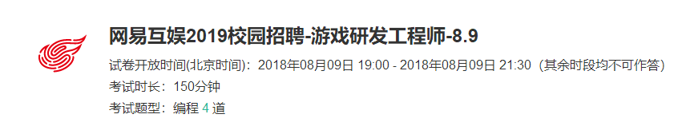
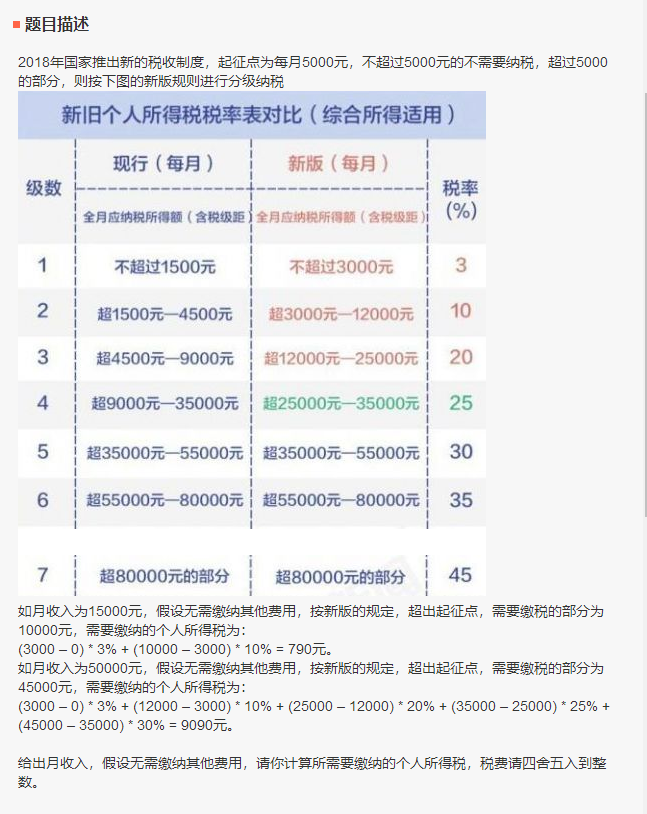
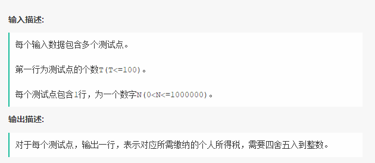
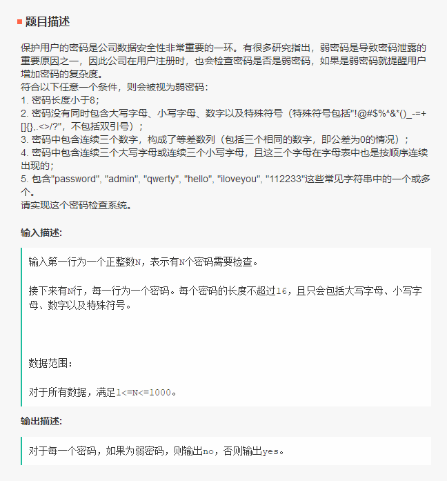
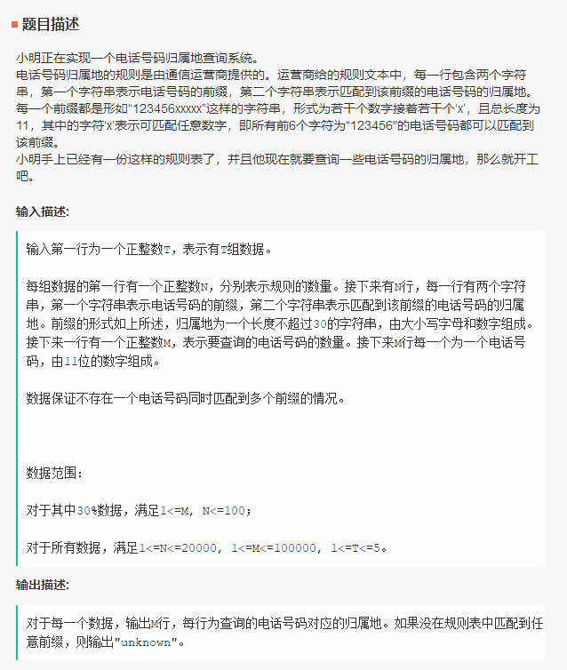

# 第一题：税收问题





输入：

```
5
5000
15000
50000
8025
10001
```

输出：

```
0
790
9090
93
290
```


#第二题：密码校验



输入：

```
10
aaabbbcccA1#
iloveyou,admin
*OldIron666
[]<>(){}
(Hello+World)*2
A2345678910JQK
Root@163.com
cba&ZYX0
pas$w0Rd
133_Ckk
```

输出：

```
yes
no
no
no
yes
no
yes
yes
yes
no
```


# 第三题：空缺

待补充...


# 第四题：号码归属地





输入：

```
2
3
1357xxxxxxx GuangZhou01
13680xxxxxx GuangZhou01
13799xxxxxx HangZhou02
3
13579246810
13680246810
13799999999
5
3333xxxxxxx nowhere
3334xxxxxxx somewhere
33355555xxx nobody
33355566666 somebody
33366666xxx NULL
10
33333333333
33344444444
33444444444
44444443334
33355566666
33355533355
33366666633
66663336633
33355533341
33338888888
```

输出：

```
GuangZhou01
GuangZhou01
HangZhou02
nowhere
somewhere
unknown
unknown
somebody
unknown
NULL
unknown
unknown
nowhere
```
