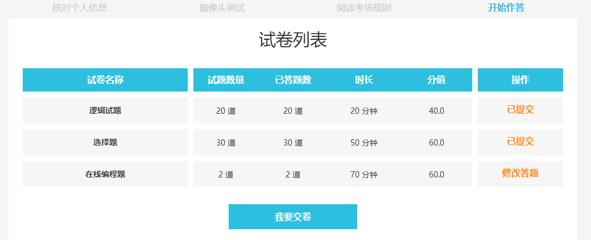
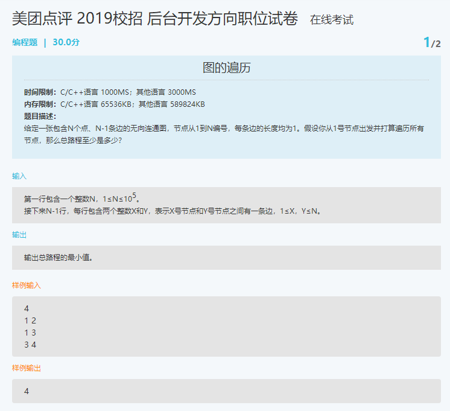

图的遍历

**时间限制：**C/C++语言 1000MS；其他语言 3000MS
**内存限制：**C/C++语言 65536KB；其他语言 589824KB

**题目描述：**

给定一张包含N个点、N-1条边的无向连通图，节点从1到N编号，每条边的长度均为1。假设你从1号节点出发并打算遍历所有节点，那么总路程至少是多少？

输入

第一行包含一个整数N，1≤N≤105。

接下来N-1行，每行包含两个整数X和Y，表示X号节点和Y号节点之间有一条边，1≤X，Y≤N。


输出

输出总路程的最小值。

样例输入

```
4
1 2
1 3
3 4
```

样例输出

```
4
```

Hint

```
按1->2->1->3->4的路线遍历所有节点，总路程为4。
```

温馨提示

请尽量在全场考试结束10分钟前调试程序，否则由于密集排队提交，可能查询不到编译结果 
点击“调试”亦可保存代码
编程题可以使用本地编译器，此页面不记录跳出次数


在线考试

编程题|30.0分2/2

区间统计

**时间限制：**C/C++语言 2000MS；其他语言 4000MS
**内存限制：**C/C++语言 131072KB；其他语言 655360KB

**题目描述：**

小明拿到了一个数列a1 , a2 , ... an ，小明想知道存在多少个区间[l,r]同时满足下列两个条件：

1、r-l+1=k;

2、在a l , a l+1,...ar中，存在一个数至少出现了 t 次。

输出满足条件的区间个数。


输入

输入第一行三个整数n,k,t(1≤n,k,t≤105。

第二行 n 个整数，a1 , a2 , ... an (1≤ai≤105)。

输出

输出一个数，问题的答案。

样例输入

```
5 3 2
3 1 1 1 2
```

样例输出

```
3
```

Hint

```
区间[1,3]中1出现了2次，区间[2,4]中1出现了3次，区间[3,5]中1出现了2次。所以一共有3个区间满足条件。
```

温馨提示

请尽量在全场考试结束10分钟前调试程序，否则由于密集排队提交，可能查询不到编译结果 
点击“调试”亦可保存代码
编程题可以使用本地编译器，此页面不记录跳出次数