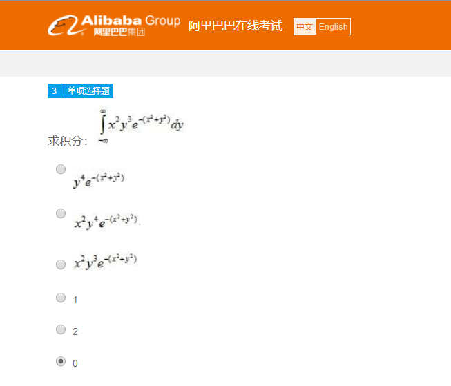
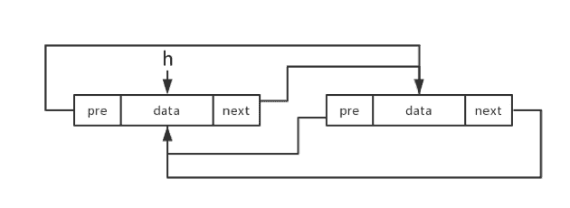
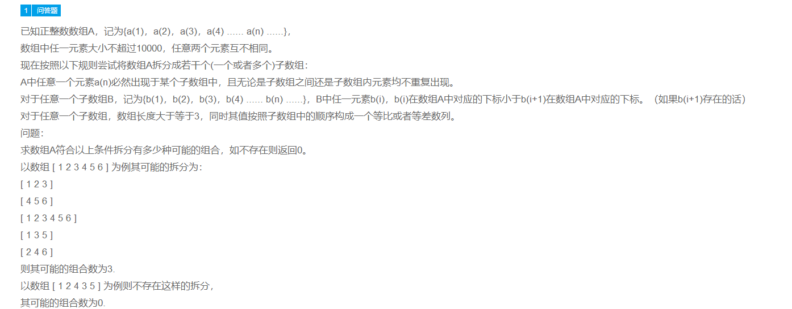

小蛙和六名小伙伴们玩「迷你UNO」的游戏，规则如下：

1. 只使用1-7的数字牌，每人从7张卡牌中抽取一张，互相不重复。
2. 轮流报数，数字必须大于前一个，且为自己数字牌的倍数

若小蛙报的数字为49，且A-F报数如下；那么请问谁持有数字牌「6」？

15

19

25

30

36

46


某送货公司需要将一车货物送出，由于时效性要求，送货需要沿着特别定制的路线，从仓库出发在城市里绕一圈，然后再回到仓库。目前有送货电车若干辆，每辆车装配一个电池组，仅能行走1/2的送货路线，花费4小时。路线中无法充电，但车辆之间的电池组的电量可以随意分配，充电或重新分配电量均需要1小时。如果使用最少的车辆进行送货，送完一次货物需要多少小时。

9

11

12

14

15

16





双向循环链表结构如下图所示，h指向头节点，则下列说法中不正确的是:




删除一个节点s的操作顺序是: s.pre.next=s.next;s.next.pre=s.pre;

在头部插入一个节点s的操作顺序是:s.next=h;s.pre=h.pre;h.pre.next=s;h.pre=s;h=s;

s指向链表中的某个节点，则只需要一个额外指针就能交换s和s的下一个节点

至少需要两个额外的指针才能反转整个链表

在尾部插入一个节点s的操作顺序是:s.pre=h.pre;s.next=h;h.pre=s;h.pre.next=s;

以上描述都不正确。


有两个包裹，其中第一个包裹中装有3瓶果汁，2瓶矿泉水，第二个包裹中装有2瓶果汁，3瓶矿泉水。从第一个包裹中任取一瓶放入第二个包裹，再从第二个包裹中任取2瓶，问两瓶都为果汁的概率是多少？

1/5

11/75

13/75

13/79

17/79

19/150


假设有一个（6点）骰子被连续掷了3次， A、B、C三种情况的定义为：

– A，有一次掷了个6

– B，前两次掷出的骰子点数之和为双数

– C，至少有一次掷了个3

那么以下哪些事件之间是相互独立的：


A和B

B和C

A和C

A和B和C

以上都不对

以上都对


当一个训练集里只有少量正样本（P）和大量无标签样本（U）时，以下哪个分类器训练方案最合理：


根据正样本的特征，通过众筹的方式人工给无标签样本打标

将无标签样本分成N份，每份与正样本数量相等，并将这些无标签样本作为负样本，训练N个分类器

从U内随机选出与正样本数量相等的样本作为负样本并训练出一个分类器

将无标签样本通过kmeans分成N份，每份与正样本数量相等，并将这些无标签样本作为负样本，训练N个分类器

首先用Spy算法，将一个正样本p_s加入无标签样本，得到两个类别，P-{p_s} 和 U+{p_s}，将p_s属于P-{p_s}的概率作为阈值，阈值以下都归类为负样本，再训练分类器

以上算法都不合理


输入图片大小为200×200，依次经过一层卷积（kernel size 5×5，padding 1，stride 2），pooling（kernel size 3×3，padding 0，stride 1），又一层卷积（kernel size 3×3，padding 1，stride 1）之后，输出特征图大小为多少？


96

97

98

99

100

101


一个特殊的虚拟机X在管理内存时会将内存分为1kb、3kb、5kb、7kb四种大小，当执行的代码需要建立对象时，X会依对象大小分配尽可能少的内存块。现在有一份代码需建立大小分别为15KB、25KB与40KB的三个对象，这些对象需同时存在，且彼此间不共享任何内存，请问要运行此段代码X最少该分配几块内存?


14

15

16

17

18

19


请计算以下代码运行时的时间复杂度:

func fun(int n)

{

  var j = 1, i = 0;

  while (i < n)

  {

    // Some O(1) task
    
    i = i + log(j);
    
    j++;

  }

}

 

 

Ө(√log(n))

Ө(1/2*(log(n)))

Ө(loglog(n))

Ө(n/log(n))

Ө(nlog(n))

Ө(2*(log(n)))





已知正整数数组A，记为{a(1)，a(2)，a(3)，a(4) ...... a(n) ......}，
数组中任一元素大小不超过10000，任意两个元素互不相同。
现在按照以下规则尝试将数组A拆分成若干个(一个或者多个)子数组：

A中任意一个元素a(n)必然出现于某个子数组中，且无论是子数组之间还是子数组内元素均不重复出现。

对于任意一个子数组B，记为{b(1)，b(2)，b(3)，b(4) ...... b(n) ......}，B中任一元素b(i)，b(i)在数组A中对应的下标小于b(i+1)在数组A中对应的下标。（如果b(i+1)存在的话）

对于任意一个子数组，数组长度大于等于3，同时其值按照子数组中的顺序构成一个等比或者等差数列。
问题：
求数组A符合以上条件拆分有多少种可能的组合，如不存在则返回0。

以数组 [ 1 2 3 4 5 6 ] 为例其可能的拆分为：
\[1 2 3 ][ 4 5 6 ]

[ 1 2 3 4 5 6 ]

\[ 1 3 5 ][ 2 4 6 ]
则其可能的组合数为3.

以数组 [ 1 2 4 3 5 ] 为例则不存在这样的拆分，
其可能的组合数为0.


**题目描述：**

小广附近有家盒马店，该店提供配送服务，配送范围是系统根据各项指标决策出的一个多边形，假设小广现在的位置为（x,y），请问小广是否在该盒马店的配送范围内，如果不在配送范围内请问他要最少要走多少距离才能到盒马店配送范围内。假设坐标点在二维平面上，不考虑地球曲率等因素。

 

**输入：**

x,y(代表小广所在的位置，x表示横坐标，y表示纵坐标)

x1,y1,x2,y2,x3,y3....xn,yn(代表该盒马店的配送范围多边形，其中x表示横坐标，y表示纵坐标，xi和yi代表多边形一个点，点与点按顺序相连形成边，并且最后一个点(xn,yn)与第一个点(x1,y1)相连）

**输出：**

请问小广是否在盒马店的配送范围内，如果不在配送范围内请问他要最少走多少距离才能到盒马店配送范围内，输出结果为整数（四舍五入）

 

**举例说明：**

输入：

1,1
0,0,0,2,2,2,2,0

输出：

yes,0

 

输入：

2,2
0,0,0,2,2,2,2,0

输出：

yes,0

 

输入：

3,0
0,0,0,2,2,2,2,0

输出：

no,1

 

输入：

3,4
0,0,0,2,2,2,2,0

输出：

no,2


```

import java.io.FileNotFoundException;
import java.util.Scanner;

public class Main {

    public static void main(String[] args) throws FileNotFoundException {
        Scanner in = new Scanner(System.in);
        System.out.println("yes,0");

    }

}

```


```

import java.io.BufferedReader;
import java.io.FileNotFoundException;
import java.io.FileReader;
import java.util.Scanner;

public class Main {

    public static void main(String[] args) throws FileNotFoundException {
        Scanner in = new Scanner(System.in);
        String xy = in.nextLine();
        int x = Integer.valueOf(xy.split(",")[0]);
        int y = Integer.valueOf(xy.split(",")[1]);

        String points = in.nextLine();


        String[] shape = points.split(",");
        int size = shape.length;
        int[] xarr = new int[size/2];
        int[] yarr = new int[size/2];

        for (int i = 0,index = 0; i < size ; i = i + 2,index++) {
            xarr[index] = Integer.valueOf(shape[i]);
            yarr[index] = Integer.valueOf(shape[i + 1]);
        }


        // 正方形
        if (size / 2 == 4) {

            int x_left = xarr[0];
            int x_right = xarr[3];
            int y_bottom = yarr[0];
            int y_top = yarr[1];

//            System.out.println(x + "," + y);
            if (x >= x_left && x <= x_right && y <= y_top && y >= y_bottom) {
                System.out.println("yes," + 0);
            } else {

                int toXRay = Math.min(Math.abs(y - y_bottom), Math.abs(y - y_top));
                int toYRay = Math.min(Math.abs(x - x_left), Math.abs(x - x_right));
                double len = Math.sqrt(toXRay*toXRay+toYRay*toYRay);


                if (x > x_right || x < x_left) {
                    if (y > y_top || y < y_bottom) {
                        System.out.println("no," + (Math.round(len)));
                    }
                    if (y <= y_top && y >= y_bottom) {
                        System.out.println("no," + toYRay);
                    }
                }
                if (y > y_top || y < y_bottom) {
                    if (x >= x_left && x <= x_right) {
                        System.out.println("no," + toXRay);
                    }
                }

            }
        } else {
            System.out.println("yes," + 0);
        }


    }

}

```

