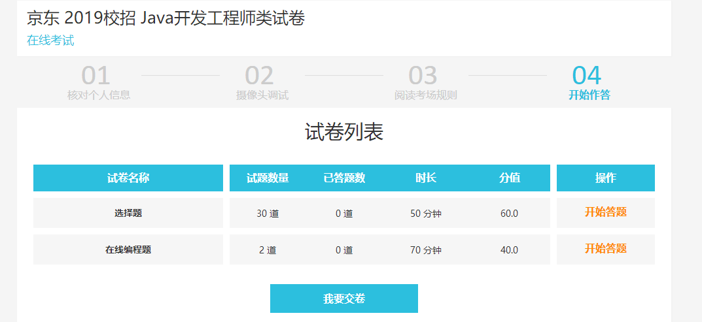
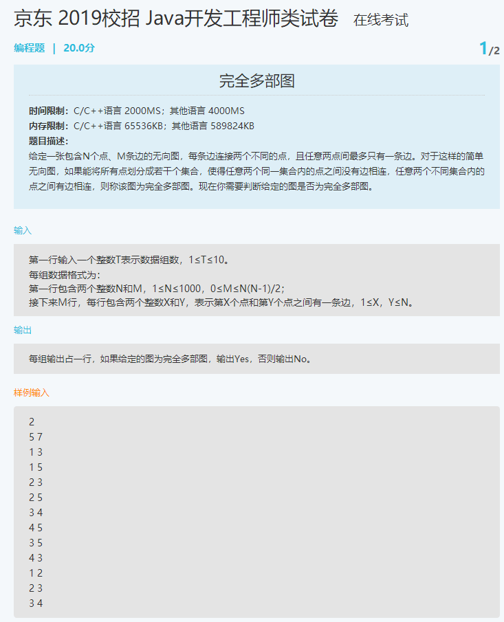
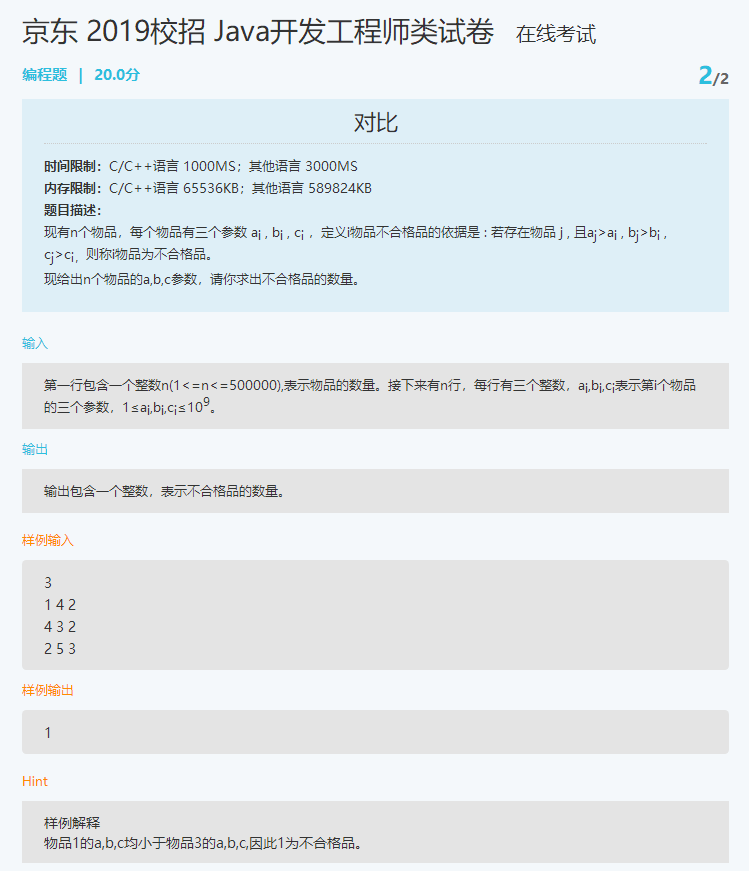

## 完全多部图

**时间限制：**C/C++语言 2000MS；其他语言 4000MS
**内存限制：**C/C++语言 65536KB；其他语言 589824KB

**题目描述：**

给定一张包含N个点、M条边的无向图，每条边连接两个不同的点，且任意两点间最多只有一条边。对于这样的简单无向图，如果能将所有点划分成若干个集合，使得任意两个同一集合内的点之间没有边相连，任意两个不同集合内的点之间有边相连，则称该图为完全多部图。现在你需要判断给定的图是否为完全多部图。

输入

第一行输入一个整数T表示数据组数，1≤T≤10。

每组数据格式为：

第一行包含两个整数N和M，1≤N≤1000，0≤M≤N(N-1)/2；

接下来M行，每行包含两个整数X和Y，表示第X个点和第Y个点之间有一条边，1≤X，Y≤N。


输出

每组输出占一行，如果给定的图为完全多部图，输出Yes，否则输出No。


样例输入

```
2  组数t
5 7  N  M
1 3
1 5
2 3
2 5
3 4
3 5
4 5

4 3  N  M
1 2
2 3
3 4
```

```
2
5 7
1 3
1 5
2 3
2 5
3 4
4 5
3 5

4 3
1 2
2 3
3 4
```


样例输出

```
Yes
No
```

```java

import java.io.BufferedReader;
import java.io.FileNotFoundException;
import java.io.FileReader;
import java.util.Scanner;

public class Main {

    public static void main(String[] args) throws FileNotFoundException {
        Scanner in = new Scanner(System.in);
        int t = in.nextInt();

        for (int i = 0; i < t; i++) {
            int n = in.nextInt(); // 点的个数
            int m = in.nextInt(); // 边的个数
            for (int k = 0; k < m; k++) {
                in.nextInt();
                in.nextInt();
            }

            if (m % 2 == 0) {
                System.out.println("No");
            }
            else{
                System.out.println("Yes");
            }
        }

    }

}

```


```C++
class Item
{
    public:
    int a;
    int b;
    int c;
    Item(int ,int ,int){};
    ~Item(){};
    bool operator<(Item& rhs)
    {
        if(a<rhs.a&& b< rhs.b&& c<rhs.c)
            return false;
    }
};
int main()
{
    vector<Item> items;
    int n;
    cin >>n;
    int count = 0;
    int a,b,c;

    while(cin>>a>>b>>c)
    {
        Item item = Item(a,b,c);
        items.push_back(item);
    }
    for(int i = 0;i<items.size();i++)
    {
        for(int j = 0;j< items.size();j++)
        {
            if(items[i] < items[j] ){
                count++;
                break;
            }

        }

    }
    cout<< count;
    return 0;
}
```





## 对比

**时间限制：**C/C++语言 1000MS；其他语言 3000MS
**内存限制：**C/C++语言 65536KB；其他语言 589824KB

**题目描述：**

现有n个物品，每个物品有三个参数 ai , bi , ci ，定义i物品不合格品的依据是 : 若存在物品 j , 且aj>ai , bj>bi , cj>ci，则称i物品为不合格品。

现给出n个物品的a,b,c参数，请你求出不合格品的数量。

输入

第一行包含一个整数n(1<=n<=500000),表示物品的数量。接下来有n行，每行有三个整数，ai,bi,ci表示第i个物品的三个参数，1≤ai,bi,ci≤109。

输出

输出包含一个整数，表示不合格品的数量。


样例输入

```
3
1 4 2
4 3 2
2 5 3
```

样例输出

```
1
```

Hint

```
样例解释
物品1的a,b,c均小于物品3的a,b,c,因此1为不合格品。
```


```java

import java.io.BufferedReader;
import java.io.FileNotFoundException;
import java.io.FileReader;
import java.util.Scanner;

public class Main {

    public static void main(String[] args) throws FileNotFoundException {
        Scanner in = new Scanner(System.in);
        int n = in.nextInt();
        int resCount = 0;

        int[] a = new int[n];
        int[] b = new int[n];
        int[] c = new int[n];
        for (int i = 0; i < n; i++) {
            a[i] = in.nextInt();
            b[i] = in.nextInt();
            c[i] = in.nextInt();
        }

        // 开始判断
        for (int i = 0; i < n; i++) {
            int ai = a[i];
            int bi = b[i];
            int ci = c[i];

            for (int j = 0; j < n; j++) {
                int aj = a[j];
                int bj = b[j];
                int cj = c[j];
                if(aj>ai && bj>bi && cj>ci){
                    resCount ++;
                    break;
                }
            }
        }

        System.out.println(resCount);
    }
}
```





