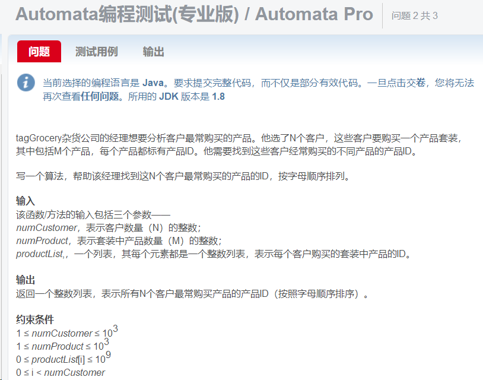
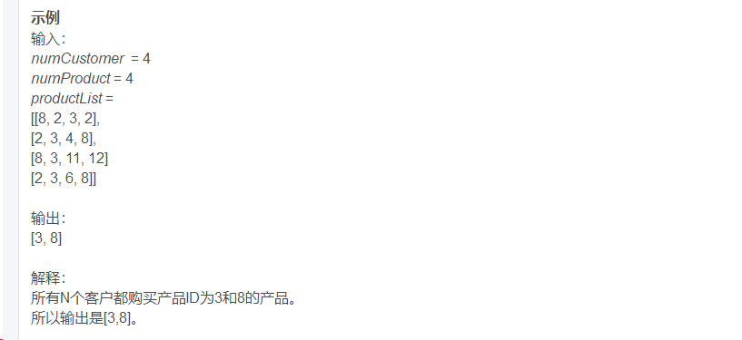

```java
// IMPORT LIBRARY PACKAGES NEEDED BY YOUR PROGRAM
// SOME CLASSES WITHIN A PACKAGE MAY BE RESTRICTED
import java.util.List;
import java.util.ArrayList;
import java.util.Collections;

// DEFINE ANY CLASS AND METHOD NEEDED
// CLASS BEGINS, THIS CLASS IS REQUIRED
public class Solution
{
    // METHOD SIGNATURE BEGINS, THIS METHOD IS REQUIRED

    List<Integer> findCommonElements(int numCustomer, int numProduct, List<List<Integer>> productList) {
        List<Integer> reslist = new ArrayList<>();


        for (int i = 0; i < numCustomer; i++) {
            List<Integer> list = new ArrayList<>();
            list = productList.get(i);
            for (int k = 0; k < numProduct; k++) {
                int item = list.get(k);
                if(reslist.contains(item)){
                    break;
                }

                int count = 0;
                for (int j = 0; j < numCustomer; j++) {
                    List<Integer> otherList = new ArrayList<>();
                    otherList = productList.get(j);
                    if (j != i) {
                        if (otherList.contains(item)) {
                            count++;
                        }
                    }
                }
                if (count == numCustomer - 1) {
                    if (!reslist.contains(item)) {
                        reslist.add(item);
                    }
                }
            }
        }

        Collections.sort(reslist);

        return reslist;
    }

}
```


