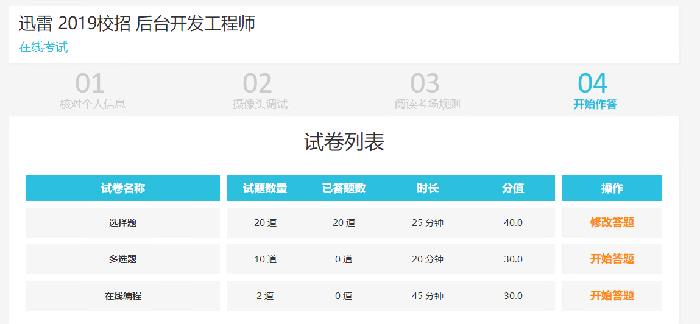

## 计算勾股数 - 后台开发工程师

**时间限制：**C/C++语言 1000MS；其他语言 3000MS
**内存限制：**C/C++语言 65536KB；其他语言 589824KB

**题目描述：**

勾股数，是由三个正整数组成的数组；能符合勾股定理 a*a + b*b = c*c ， (a, b, c) 的正整数解。如果 (a, b, c) 是勾股数，它们的正整数倍数，也是勾股数。如果 (a, b, c) 互质，它们就称为素勾股数。给定正整数N，计算出小于或等于N的素勾股数个数。(0 < a <= b <= c <= N)

输入

正整数N

输出

小于或等于N的素勾股数个数

(0 < a <= b <= c <= N)

样例输入

```
10
```

样例输出

```
1
```

```java

import java.io.FileNotFoundException;
import java.util.Scanner;

public class Main {

    public static void main(String[] args) throws FileNotFoundException {
        Scanner in = new Scanner(System.in);
        int maxnum = in.nextInt();
        int count = 0;

        for (int i = 1; i <= maxnum; i++) {
            for (int j = i; j <= maxnum; j++) {
                for (int k = j + 1; k <= maxnum; k++) {
                    if ((i * i + j * j) == k * k) {
                            if (check(i, j) && check(j, k) && check(i, k)) {
                                count++;
                            }
              
                    }
                }
            }
        }
        System.out.println(count);
    }

    public static boolean check(int m, int n) {
        return check2(m > n ? m : n, m <= n ? m : n);
    }

    public static boolean check2(int max, int min) {
        int mo = max % min;
        if (mo == 0) {
            return min == 1 ? true : false;
        } else {
            return check2(min, mo);
        }
    }

}

```


## 红黑积木求和 - 后台开发工程师

**时间限制：**C/C++语言 1000MS；其他语言 3000MS
**内存限制：**C/C++语言 65536KB；其他语言 589824KB

**题目描述：**

有红黑两种颜色的方块积木，红色代表正数A，黑色代表负数B。选出17块积木排成一排，使得任意相邻7块积木之和都小于0。如何挑选才能使17块积木之和最大，最大值是多少？


输入

正数A，负数B

A和B绝对值小于10000


输出

积木之和的最大值

样例输入

```
10 -61
```

样例输出

```
28
```

