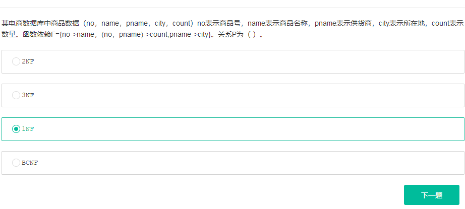
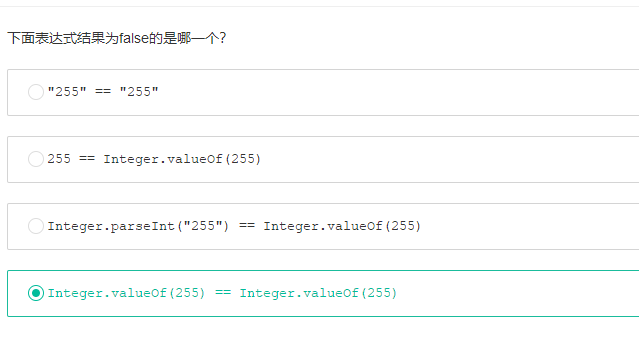

true
true
true
false


判断单链表中是否有环，找到环的入口节点 - CSDN博客
https://blog.csdn.net/u011373710/article/details/54024366


```java
if(h == null || h.next == null)
    return null;
ListNode slow = h;
ListNode fast = h;
while(fast != null && fast.next != null ){
    slow = slow.next;
    fast = fast.next.next;
    if(slow == fast){
        ListNode p=h;
        ListNode q=slow;
        while(p != q){
            p = p.next;
            q = q.next;
        }
        if(p == q)
            return q;
    }
}
return null;
```


