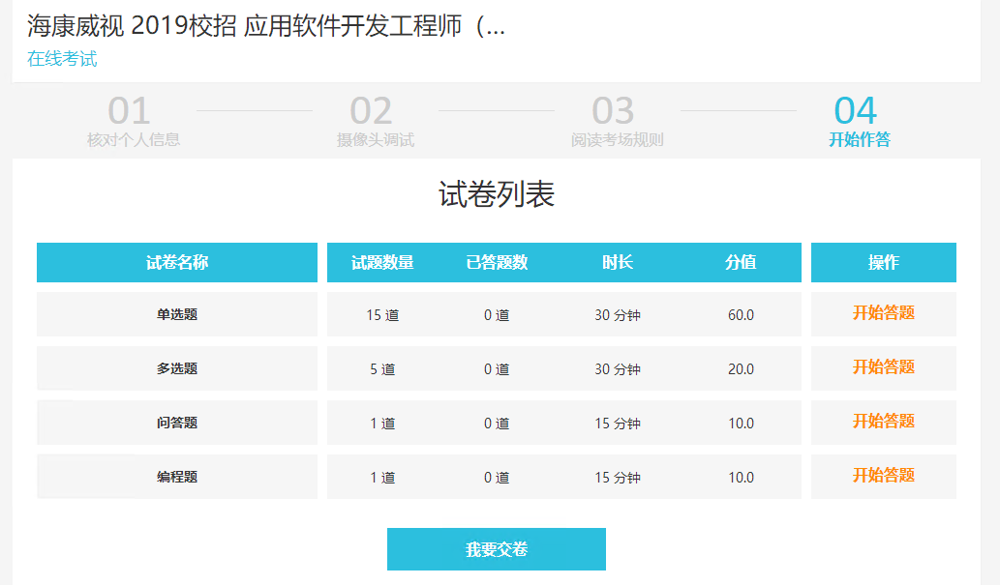
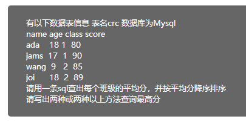

 

第一种：通过group by方式分组

select class,avg(score) as average from crc group by class order by average desc

第二种：通过sum(score)/count(*)方式分组

select class, sum(score)/count(*) as average from crc group by class order by average desc

 